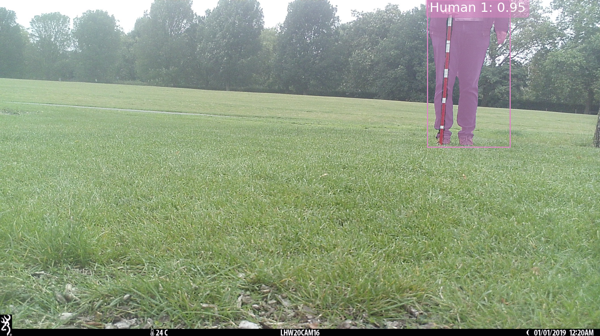
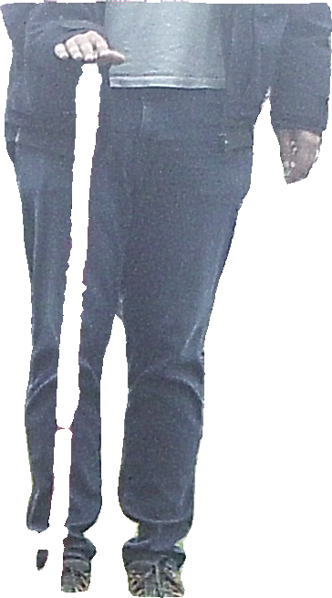

# Segment Animals

Segment Animals is a Python package for segmenting (extracting) animals from images using deep learning models. It provides a pipeline that combines object detection and segmentation to identify and extract animals from images, making it useful for wildlife research, conservation efforts, and any application where you wish to remove the background from images containing animals.

Segment Animals builds upon the [Segment Anything 2 (SAM 2.1)](https://github.com/facebookresearch/sam2) and [MegaDetector](https://github.com/agentmorris/MegaDetector/blob/main/getting-started.md) models.

# Installation

Install Segment Animals and its dependencies with pip:

```bash
pip install segment-animals
```

## Usage

Here's a quick example of how to use Segment Animals, for a more detailed guide refer to the [notebook](https://github.com/bencevans/segment-animals/blob/main/notebook.ipynb).

### Importing the library and processing an image

```python
from segment_animals import AutoSegmenter
from segment_animals.util import load_image

model = AutoSegmenter()  # Defaults to detection_classes=("animal",)

image = load_image("path/to/your/image.jpg")

detections, masks = model.process_image(image)
print(f"Found {len(detections)} animals.")
```

### Choosing a segmentation model

The default is `sam2.1_hiera_large`. For a smaller model, pass
`segmentation_model_name` when creating the pipeline:

```python
model = AutoSegmenter(segmentation_model_name="sam2.1_hiera_tiny")
```

Available models are `sam2.1_hiera_tiny`, `sam2.1_hiera_small`,
`sam2.1_hiera_base_plus`, and `sam2.1_hiera_large`. Checkpoints are downloaded
on first use through Hugging Face Transformers and reused from the Hugging Face
cache. Set `HF_HOME` to choose a different cache location.
The former `vit_h`, `vit_l`, and `vit_b` names are no longer supported.

For development, install dependencies with `uv sync`.
CPU, CUDA, and MPS devices can be selected with `segmentation_device`.

### Visualizing detections and masks

```python
from segment_animals.viz import plot_detections_and_masks

plot_detections_and_masks(image, detections, masks)
```

You should then see a visualisation along the lines of this ([original image from Wikipedia](https://commons.wikimedia.org/wiki/File:Camouflaged_Predator.jpg))...


### Extracting and saving masks

```python
from segment_animals.viz import extract_masks

# Setting whole_image to False will return individual masks cropped to the extent
# of the predicted masks.
for i, mask_extract in enumerate(extract_masks(image, masks, whole_image=False)):
    # mask_extract is a PIL Image object so you can save it or manipulate it further
    mask_extract.save(f"animal_mask_{i}.png")
```

Resulting in something like this:


### Segmenting Animals, Humans and Vehicles

Segment Animals can also detect and segment the additional classes supported by
MegaDetector: humans and vehicles. Specify `detection_classes` on
`AutoSegmenter` to select any combination
of `"animal"`, `"human"`, and `"vehicle"`. The default is `("animal",)`.

```python
from segment_animals import AutoSegmenter

model = AutoSegmenter(detection_classes=("animal", "human", "vehicle"))
detections, masks = model.process_image(image)

# For humans only:
model = AutoSegmenter(detection_classes=("human",))
```

The existing visualization and mask extraction functions work with these masks.
Selection happens before segmentation, so only the selected classes get masks.
`AutoAnimalSegmenter` remains supported but emits a `DeprecationWarning`.
Replace it with `AutoSegmenter()` for animals, or
`AutoSegmenter(detection_classes=("animal", "human"))` when migrating from
`AutoAnimalSegmenter(include_humans=True)`.

Each `Detection` has a `category` of `"animal"`, `"human"`, or `"vehicle"`.
The original `AnimalDetection` name remains an alias for `Detection`. Filter detections
and masks using the same indices to preserve their alignment:

```python
indices = [i for i, d in enumerate(detections) if d.category == "human"]
human_detections = [detections[i] for i in indices]
human_masks = masks[indices]
```

Use `"animal"` instead to select animals.

#### Human segmentation example

This camera-trap image includes a person partially outside the frame:

Detect and segment the human, then draw the box and mask:

```python
from segment_animals import AutoSegmenter
from segment_animals.util import load_image
from segment_animals.viz import plot_detections_and_masks

image = load_image(
    "https://raw.githubusercontent.com/bencevans/segment-animals/main/example_human.jpg"
)
model = AutoSegmenter(detection_classes=("human",))
detections, masks = model.process_image(image)

for detection in detections:
    print(detection.category, detection.confidence, detection.bbox)

plot_detections_and_masks(image, detections, masks)
```

The plotted label uses the detection category (`Human`). Masks cover the visible
part of the person; the model cannot recover parts outside the image.

Running this image through the default MegaDetector `redwood` and SAM 2.1
`sam2.1_hiera_large` models detected one human with confidence `0.952`:



The extracted human has a transparent background:



## Working with Segment Animals?

It'd be great to hear how you're using Segment Animals! Drop me a line at Benjamin.Evans at ioz.ac.uk or open an issue on the [GitHub repository](https://github.com/bencevans/segment-animals/issues).
